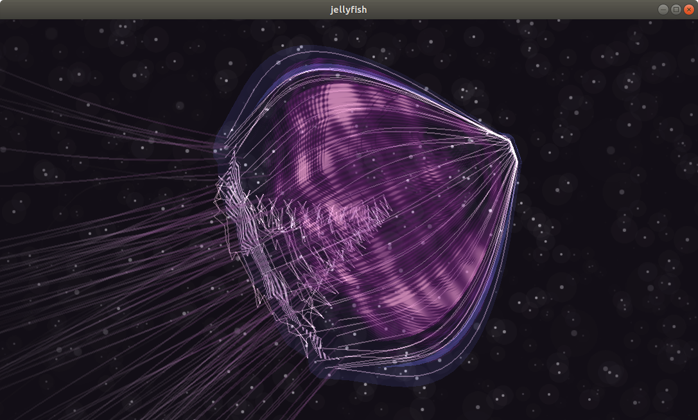

# Jellyfish

[](https://guijiangheng.github.io/particle-system/)

> Soft body jellyfish simulation

ParticleSystem.js，一个基于vertlet integration的粒子系统，参照[particulate-medusae](https://github.com/jpweeks/particulate-medusae)实现的，不过进行了简化和重写。这个Jellyfish的演示，就是基于ParticleSystem.js实现soft body simulation的。不过原来的Demo实在是太精美，如何使用这套粒子系统让动画看起来逼真还是很复杂的，我时间有限，只能做个大概了。

### Usage

下面是一个如何使用ParticleSystem.js的[例子](https://guijiangheng.github.io/particle-system/chain)。

```js
import * as THREE from 'three';
import {
  Vector3,
  ParticleSystem,
  DirectionalForce,
  BoxConstraint,
  Line
} from '../src/index';

import './styles.css';

const renderer = new THREE.WebGLRenderer({
  antialias: true
});
renderer.setSize(window.innerWidth, window.innerHeight);
document.body.appendChild(renderer.domElement);

const scene = new THREE.Scene();
const camera = new THREE.PerspectiveCamera(
  30,
  window.innerWidth / window.innerHeight,
  0.1,
  3500
);

camera.position.set(0, 200, 500);
camera.lookAt(new THREE.Vector3());

const box = new THREE.Mesh(
  new THREE.BoxGeometry(100, 100, 100, 1, 1, 1),
  new THREE.MeshBasicMaterial({
    wireframe: true
  })
);
scene.add(box);

const system = new ParticleSystem(2);
system.friction = 0.99;

const gravity = new DirectionalForce(new Vector3(0, -0.1, 0));
system.addForce(gravity);

const boxConstraint = new BoxConstraint(
  new Vector3(-50, -50, -50),
  new Vector3(50, 50, 50)
);
system.addConstraint(boxConstraint);

const line = new Line(new Vector3(-10, 0, 0), new Vector3(10, 0, 0), 30, 120);
line.pinFirst().pinLast();
system.addComposite(line);

const lineGeometry = new THREE.BufferGeometry();
lineGeometry.addAttribute(
  'position',
  new THREE.BufferAttribute(line.getPositionBuffer(), 3)
);
lineGeometry.setIndex(new THREE.BufferAttribute(line.getIndexBuffer(), 1));
scene.add(new THREE.Line(lineGeometry, new THREE.LineBasicMaterial()));

(function animate() {
  requestAnimationFrame(animate);
  system.update();
  lineGeometry.attributes.position.needsUpdate = true;
  renderer.render(scene, camera);
})();

window.onresize = () => {
  renderer.setSize(window.innerWidth, window.innerHeight);
  camera.aspect = window.innerWidth / window.innerHeight;
  camera.updateProjectionMatrix();
};

```

### Build

```sh
npm install
npm start
```
